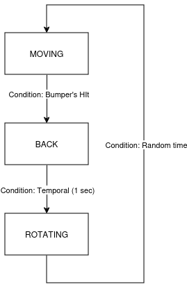
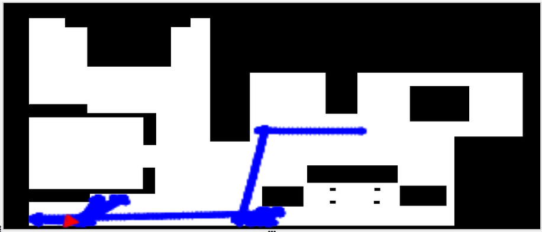
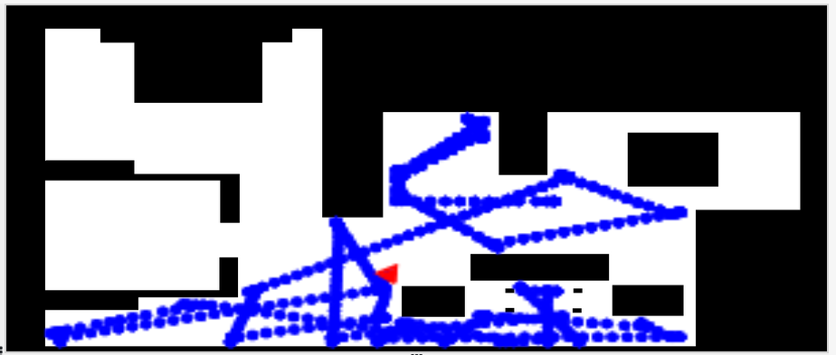
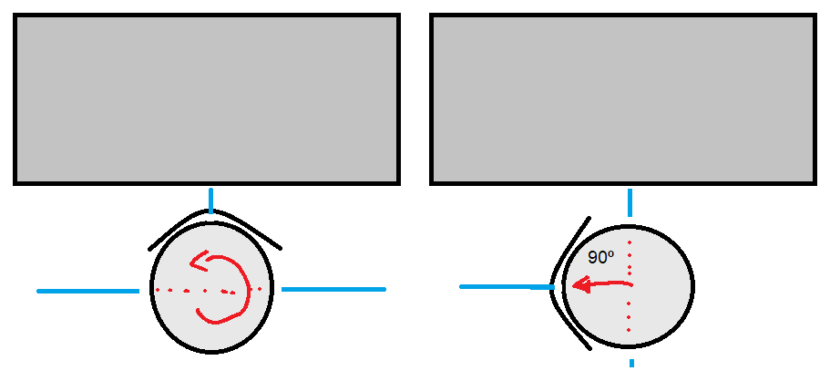

# P1 Vacuum_Cleaner

## Introducción

El objetivo de la siguiente práctica es la implementación de un algoritmo que consiga el mayor rendimiento posible para una aspiradora robótica. Sin embargo, tendremos solo a nuestra disposición el uso del bumper (sensor de choque) y el sensor laser.

## Algoritmo bumper aleatorio

### Primeras experiencias y resultados

Las primeras pruebas que realice fueron para conocer el funcionamiento del bumper y concretar que tan sensible era. Los resultados no fueron los esperados:

- Los bumpers laterales izquierdo y derecho tienen un área de choque pequeña en comparación con la central. Esto es un problema a la hora de detectar qué zona ha golpeado realmente.

- El sensor devuelve el valor equivalente a la parte central aunque no esté siendo golpeada. Si no se tiene en cuenta, el funcionamiento del algoritmo podría no ser el esperado. 

Los siguientes días los dedique al desarroyo del giro.

El primer objetivo fue conseguir controlar el tiempo de giro para lograr conseguir ángulos exactos.

No pude obtener el comportamiento deseado, ya que el tiempo de giro era poco preciso. En este caso, una aproximación con la posición del robot hubiera dado mejor resultado.

El segundo objetivo fue la implementación del laser para la realización del giro. Más adelante comentaré los detalles y pruebas realizadas.

Como último objetivo planteé el uso de tiempo aleatorio en el giro; esto me permite conseguir un comportamiento seudo-aleatorio.

Después de todas las comprobaciones y pruebas, llegue al siguiente planteamiento.

Este algoritmo no se aleja mucho de los primeros pasos tomados, pero la principal diferencia es en el resultado sobre el plano.

#### Primeros pasos

#### Resultado final

### Video del funcionamiento

[https://urjc-my.sharepoint.com/:v:/g/personal/e_martint_2022_alumnos_urjc_es/EY-9P5p2xh5LtlTjm74tYSMBickSX3LfNDxW7yhTOQpMIw?nav=eyJyZWZlcnJhbEluZm8iOnsicmVmZXJyYWxBcHAiOiJPbmVEcml2ZUZvckJ1c2luZXNzIiwicmVmZXJyYWxBcHBQbGF0Zm9ybSI6IldlYiIsInJlZmVycmFsTW9kZSI6InZpZXciLCJyZWZlcnJhbFZpZXciOiJNeUZpbGVzTGlua0NvcHkifX0&e=gzXhVg]

## Algoritmo laser experimental 

Esta rama de investigación fue llevada acabo con el fin de conseguir un giro "perfecto" con un ángulo determinado.

### Primeras experiencias y resultados

Las primeras pruebas realizadas consistieron en determinar qué datos eran los trasmitidos por el láser y cómo manejarlos. Los resultados dieron como resultado el siguiente problema:

- Las medidas recogidas por el laser son imprecisas y muy cambiantes. No es un problema grave, pero dificulta la obtención de un giro.

Tras conocer las limitaciones del láser, me planteé la posibilidad de determinar el ángulo de giro tomando como referencia el láser emitido en la parte lateral del robot. La idea fue la siguiente:

_Cuando el robot choca de manera frontal y se inicia el giro en sentido horario o antihorario, se toma una primera instantánea de la distancia en el lado externo de la circunferencia. A medida que el robot gira, la distancia recogida por el laser irá reduciéndose hasta que se tomen datos perpendiculares a la pared, estos equivaldrían a dar un giro de 90º_

La primera aproximación que encontré a la idea fue la siguiente:

Tras ejecutar el código, confirme totalmente que las medidas del laser no son del todo precisas. Si iniciamos un giro y tomamos las distancias durante todo el recorrido, veremos que los datos no son correlativos. Aquí es donde encontrar la perpendicularidad se volvió algo complicado.

En este punto retomé la línea de investigación con respecto al uso del bumper y el tiempo aleatorio.

### Video del funcionamiento

[https://urjc-my.sharepoint.com/:v:/g/personal/e_martint_2022_alumnos_urjc_es/ESbIRE_tPzRMrOdwiWTWP2QB4XOqTrVhDRxxFVCf0zlk-g?nav=eyJyZWZlcnJhbEluZm8iOnsicmVmZXJyYWxBcHAiOiJPbmVEcml2ZUZvckJ1c2luZXNzIiwicmVmZXJyYWxBcHBQbGF0Zm9ybSI6IldlYiIsInJlZmVycmFsTW9kZSI6InZpZXciLCJyZWZlcnJhbFZpZXciOiJNeUZpbGVzTGlua0NvcHkifX0&e=89ON02]

## Conclusión

Conocer la posición del robot hubiera dado otro tipo de enfoque al problema y otras posibles implementaciones. Aun así, tras haber investigado las posibles soluciones, he decidido quedarme con la rama de Bumper con giro aleatorio, con el cual he conseguido buenos resultados.
