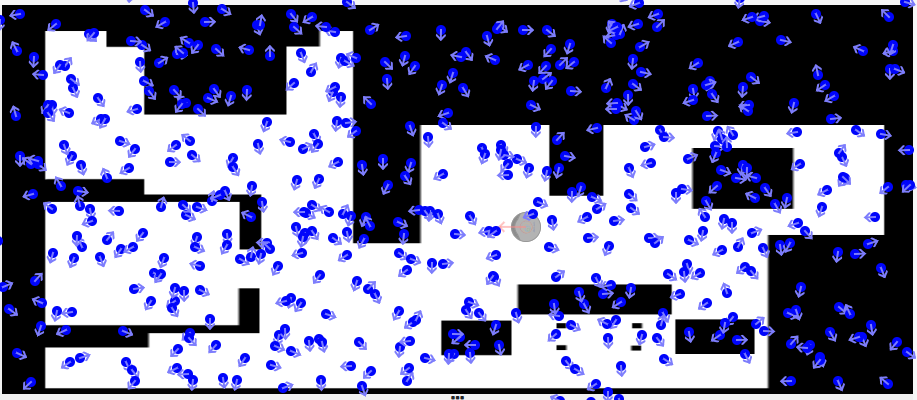
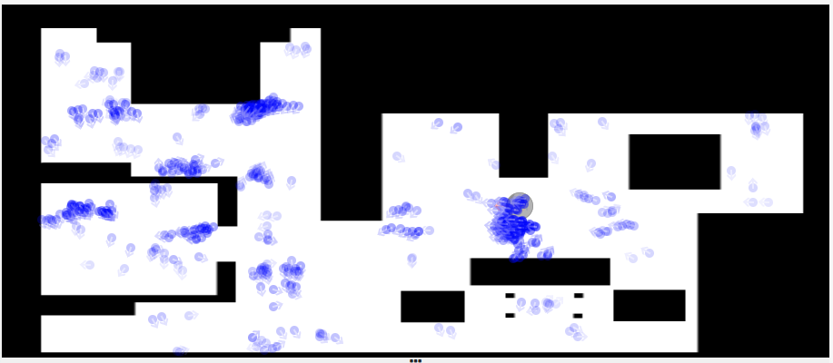
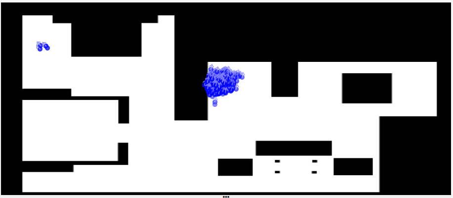
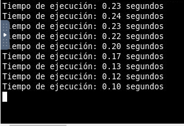

# P5 Montecarlo localization

## Introducción

La práctica consiste en la creación de un algoritmo de localización basado en el uso de partículas y un sensor láser en el robot. Se empleará el uso de probabilidades usando la técnica de Montecarlo.

La aproximación a este problema se realizará mediante 4 partes:

1. Modelo probabilístico de observación: Esta fase se encarga de inicializar las partículas de manera aleatoria por el espacio de trabajo. Con esta distribución simulamos de manera hipotética la posición del robot.

2. Modelo de movimiento: Este es el encargado de desplazar las partículas acompasadas por el movimiento del robot. Es importante destacar que el movimiento nunca es perfecto y por ello se añade ruido al desplazamiento de las partículas.

4. Asignación de los pesos: Tras un desplazamiento, recogemos las medidas de los láseres reales y simulamos las mediciones por cada partícula creada. Estas medidas darán como resultado distancias, las cuales emplearemos para hallar las diferencias y asignar pesos a las partículas en función de las similitudes de estas medidas.

5. Regeneración de partículas (Resampling): Una vez que se tienen las probabilidades, se hace uso del algoritmo de la ruleta. Este permite redistribuir las partículas a las zonas con mayor probabilidad.

 

## Experiencias y resultados

### Modelo probabilístico

Para conseguir que las partículas quedaran distribuidas de manera uniforme sobre la zona de trabajo, recordé que puedo dividir el espacio en cuadrantes y ubicar una partícula aleatoriamente dentro de estos.

En función del número de partículas, se generarían más o menos cuadrantes distribuidos uniformemente por el área de trabajo. 

**Fórmula empleada**

$squareAprox = \sqrt{num particles}$

$squareHeight = \frac{spaceHeight}{squareAprox}$

$squareWidth = \frac{spaceWidth}{squareAprox}$

### Modelo de movimiento

El cálculo se realiza sobre la distancia teórica del robot, recogida desde getOdom(). Se debe calcular la diferencia de posiciones, la inicial del robot y la posterior al movimiento, añadiendo consigo un ruido a la nueva coordenada calculada.

El resultado permite desplazar las partículas de manera similar al movimiento real del robot.

**Fórmula empleada**

$Desplazamiento = Distancia Inicial(X,Y,\theta) – Distancia Final(X,Y,\theta)$

### Asignación de pesos

Tras el desplazamiento de las partículas, se procesará individualmente cada una de ellas con los datos recibidos por el láser. En esta ocasión, para poder procesar todas las partículas se ha empleado multiprocessing. La fórmula empleada es la diferencia entre las distintas medidas del láser, frente a las estimaciones de la partícula a procesar.

**Fórmula empleada**

$P(X,Y,\theta) = e^{-distancia(obsLaser - obsParticula)}$

### Regeneración de partículas (Resampling)

Las partículas en población T+1 se generan de manera aleatoria, pero cuando la FDP indica que hay una zona prometedora en instante T, las nuevas partículas se crearán con mayor concentración sobre esa zona. También se le añade ruido, para que las partículas simulen los posibles errores del robot a la hora de desplazarse.

### Video del funcionamiento

[Video del funcionamiento](https://urjc-my.sharepoint.com/:v:/g/personal/e_martint_2022_alumnos_urjc_es/EevEh02F65VIocZLRoER5_wBfNyFIEVtdhfH7gJPJ7cAHg?nav=eyJyZWZlcnJhbEluZm8iOnsicmVmZXJyYWxBcHAiOiJPbmVEcml2ZUZvckJ1c2luZXNzIiwicmVmZXJyYWxBcHBQbGF0Zm9ybSI6IldlYiIsInJlZmVycmFsTW9kZSI6InZpZXciLCJyZWZlcnJhbFZpZXciOiJNeUZpbGVzTGlua0NvcHkifX0&e=emcbig)

### Observaciones

- He empleado un sistema Bump and go para que el movimiento del robot sea mucho más aleatorio.

- Como el tiempo es un factor importante, he tomado medidas durante la ejecución del código, obteniendo los siguientes tiempos:

- Tras ejecutar el código un cierto número de veces en la plataforma, las partículas, en ocasiones, tardan más en converger.

- La fórmula empleada para el cálculo de los pesos es algo confusa, en especial cuando se manejan un gran número de datos del láser y de partículas.

